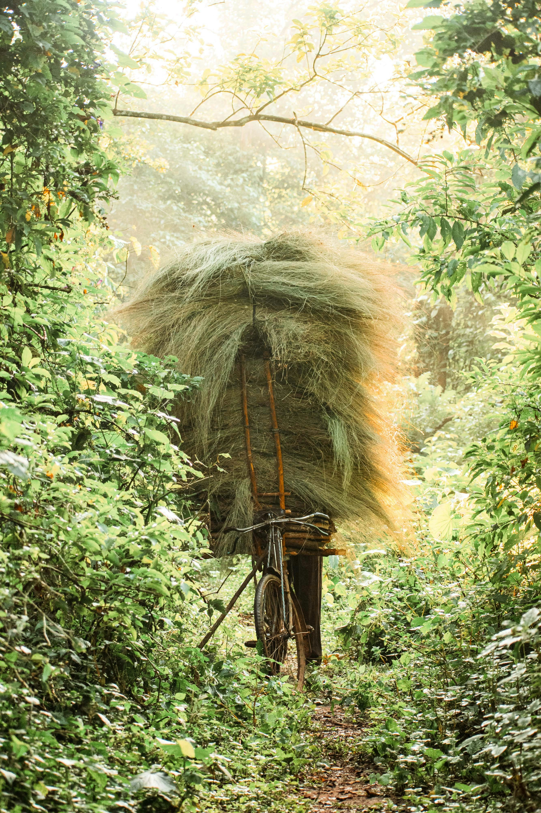
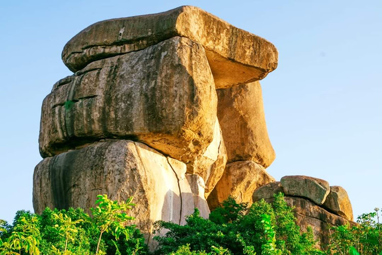
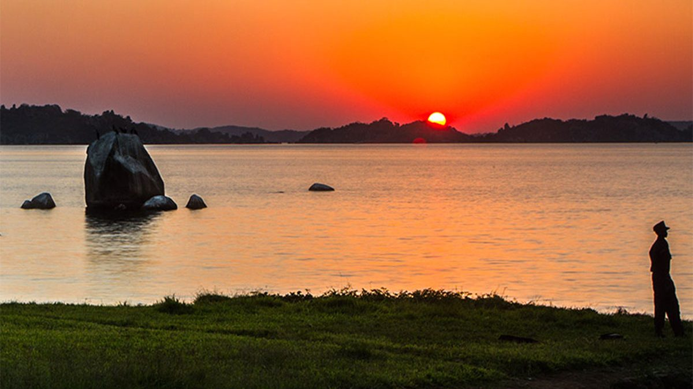
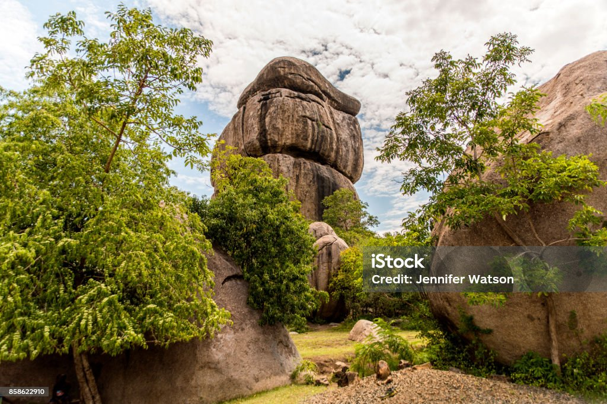
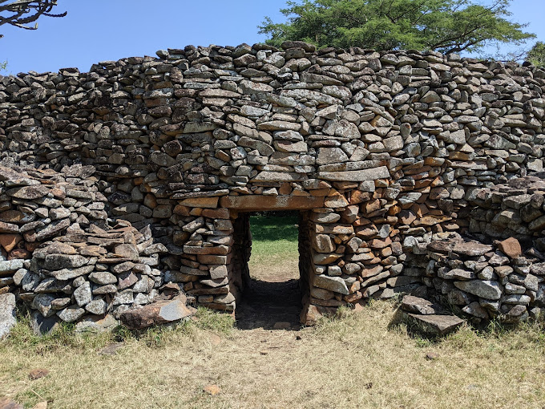
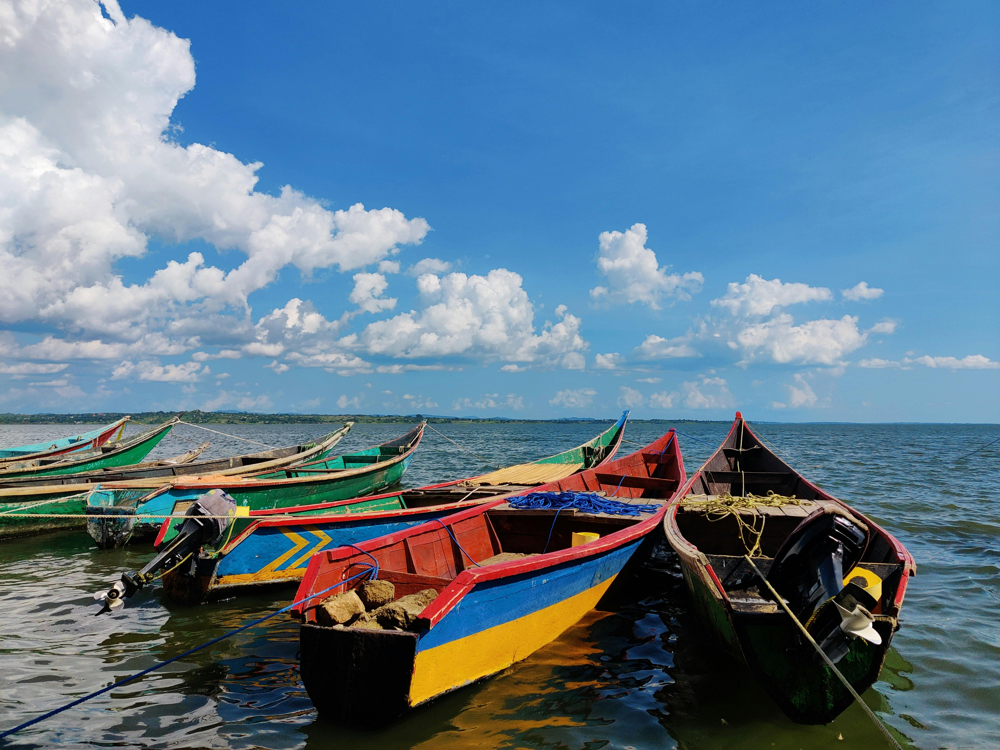
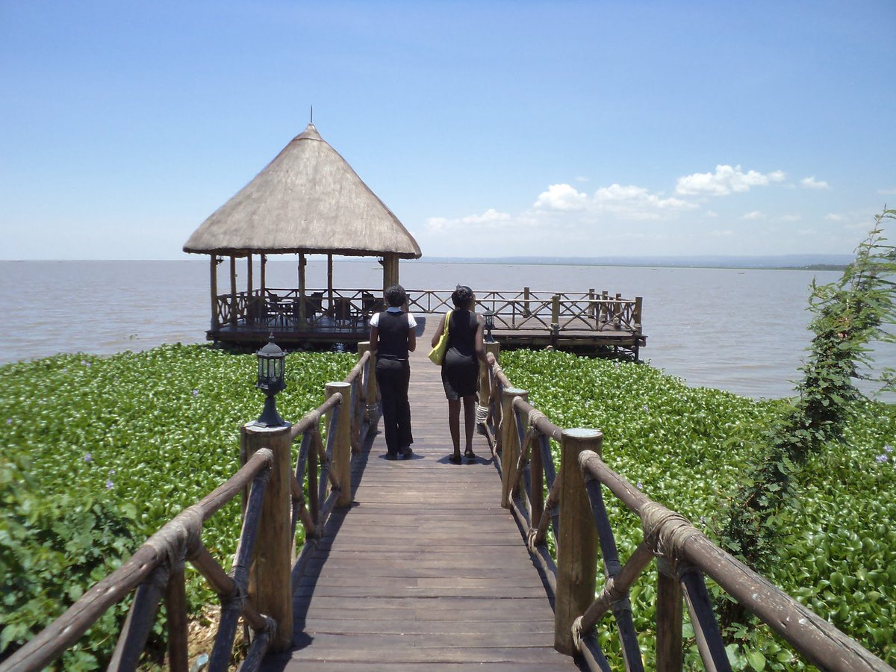

Western Kenya is a region rich in culture, history, and breathtaking landscapes. It offers visitors the opportunity to experience both the tranquility of nature and the vibrancy of local traditions. From lush forests and waterfalls to historical landmarks, Western Kenya is a must-visit destination for nature lovers, adventurers, and culture enthusiasts alike. Here are some top places to visit.

<a href="#Kakamega Forest National Reserve"> <h3> 1. Kakamega Forest National Reserve </h3> </a>
Kakamega Forest is the only tropical rainforest in Kenya, boasting an impressive variety of flora and fauna. This ancient forest is home to over 380 species of birds, including the rare Great Blue Turaco, and more than 400 species of butterflies. It’s perfect for bird watchers, nature enthusiasts, and those who seek a peaceful retreat.

<ul>
<li><b>Location:</b> Kakamega County, about 40 km from Kisumu.</li>
<li><b>Best time to visit:</b> June to October during the dry season, for easier trekking.</li>
<li><b>How to get there:</b> From Kisumu, drive northwest via Kakamega-Kisumu Road, or use public transport.</li>
</ul>

<a href="#Kit Mikayi"> <h3> 2. Kit Mikayi </h3> </a>
Kit Mikayi, which translates to "the stone of the first wife" in Luo language, is a large rock formation about 40 meters high. The rock is steeped in Luo mythology and is a significant spiritual site. Visitors can explore the caves and enjoy the scenic beauty of the surrounding landscape.

<ul>
 <li> <b> Location: </b> Seme, about 30 km from Kisumu. </li>
 <li> <b> Best time to visit: </b> All year round, but mornings offer cooler temperatures for hiking. </li>
 <li> <b> How to get there:</b> From Kisumu, take the Kisumu-Bondo Road. The site is easily accessible via public 
  transport or private vehicle. </li>
  </ul>

<h3> 3. Rusinga Island </h3>
Rusinga Island is located on the northeastern shore of Lake Victoria and is renowned for its serene beaches, historical sites, and birdlife. The island is a fantastic destination for those seeking both relaxation and adventure. It is also home to the annual Rusinga Festival, which celebrates the local culture.

<ul>
<li> <b>Location:</b> Homa Bay County, on Lake Victoria.</li>
<li> <b>Best time to visit:</b> December, during the Rusinga Festival, or from June to August for bird watching.</li>
<li> <b>How to get there:</b> Drive or take a boat from Mbita Point, which is accessible via a road from Homa Bay.</li>
</ul>

<h3> 4. Ndere Island National Park</h3>
Located on Lake Victoria, Ndere Island National Park is a tranquil haven for wildlife lovers. The island is home to impalas, monitor lizards, hippos, and a wide variety of birds. Visitors can take a boat trip around the island or go on a guided nature walk to explore its beauty.

<ul>
<li> <b>Location:</b> 40 km west of Kisumu, on Lake Victoria.</li>
<li> <b>Best time to visit:</b> Dry season (June to October) for wildlife viewing.</li>
<li> <b>How to get there:</b> Take a boat from Kisumu’s Dunga Beach, or drive to the park entrance near Kombewa.</li>
</ul>
<h3> 5. Crying Stone of Ilesi </h3>
The Crying Stone, a natural rock formation that resembles a human figure "crying" due to constant water flow, is a unique site. It holds spiritual significance among the Luhya people and is surrounded by myths and legends. The area offers panoramic views and opportunities for photography.

<ul>
<li> <b>Location:</b> Kakamega County, 15 km from Kakamega town.</li>
<li> <b>Best time to visit:</b> Any time of year.</li>
<li> <b>How to get there:</b> Easily accessible via Kakamega-Kisumu Road, about a 30-minute drive from Kakamega town.</li>
</ul>

<h3> 6. Thimlich Ohinga </h3>
A UNESCO World Heritage Site, Thimlich Ohinga is an ancient stone-walled settlement dating back over 500 years. It offers insights into the architectural practices of early communities in the region. History buffs will find this site fascinating, with its well-preserved stone walls and historical significance.

<ul>
<li> <b> Location:</b> Migori County, about 180 km from Kisumu.</li>
<li> <b> Best time to visit:</b> Year-round, but the cooler months from June to September make it more comfortable.</li>
<li> <b> How to get there:</b> Drive from Kisumu through Kisii, or take public transport to Migori and hire a local guide. They are really affordable. </li>
</ul>

<h3> 7. Lake Victoria Beaches (Dunga Beach and Hippo Point) </h3>
For a relaxing day by the water, Lake Victoria’s beaches offer stunning views and the chance to spot hippos and crocodiles. Dunga Beach is a great spot for boat rides, bird watching, and enjoying fresh fish. Hippo Point is famous for its sunsets and provides excellent photo opportunities.

<ul>
<li> <b> Location:</b> Kisumu City, on Lake Victoria’s shores.</li>
<li> <b> Best time to visit:</b> Early mornings or late afternoons for cooler temperatures and better wildlife sightings.</li>
<li> <b> How to get there:</b> Both locations are within Kisumu City, accessible by public or private transport.</li>
</ul>
