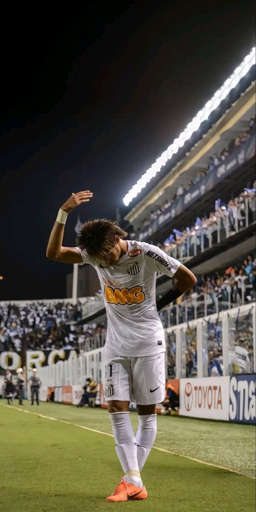
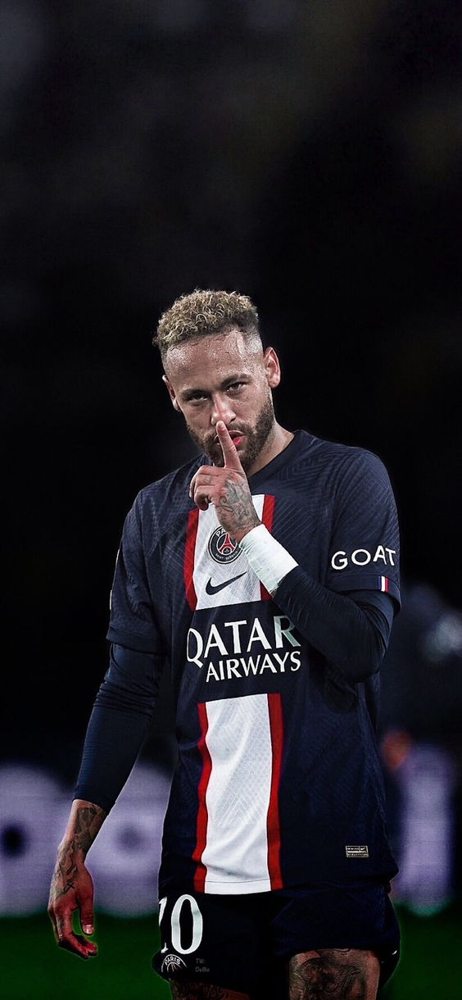
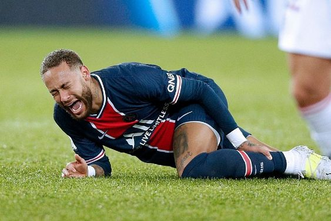
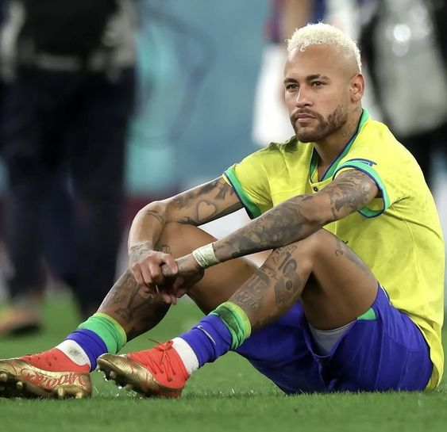
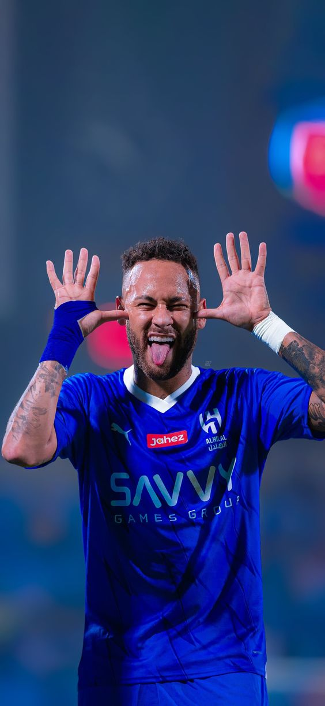

<h1>Neymar: How the Prince failed to Be the King</h1>
Neymar da Silva Santos Júnior, widely known as Neymar, has been one of the most recognizable figures in global football for over a decade. From his meteoric rise at Santos FC to his record-breaking transfer to Paris Saint-Germain (PSG), Neymar has often been regarded as one of the most gifted players of his generation. However, despite his undeniable talent, his career has not reached the levels of global dominance that many had predicted. This article explores how Neymar’s price tag and potential have clashed with reality, leading to his failure to truly ascend to the throne of football’s elite.

<h2>The Golden Prodigy at Santos</h2>
Neymar’s journey to stardom began at Santos FC, where he emerged as one of Brazil’s most promising talents in the late 2000s. His quick feet, dazzling dribbling skills, and audacious flair drew comparisons to legends like Pelé and Ronaldinho. By the time he turned 19, Neymar was already a national icon in Brazil, leading Santos to their first Copa Libertadores title since Pelé’s era.

It wasn’t just his skills on the pitch that attracted attention; his brand appeal made him a marketable asset. European clubs began circling, eager to bring the young star to Europe’s biggest leagues. Eventually, Barcelona secured Neymar’s signature in 2013 in a highly anticipated transfer. The Brazilian forward would join Lionel Messi and Luis Suárez to form one of the most fearsome attacking trios in football history—known as “MSN.”

<h2>Barcelona: A Glimpse of the Crown</h2>
Neymar’s time at Barcelona provided a glimpse of what many believed would be a future king of football. He was an integral part of the club’s success, winning the UEFA Champions League in 2015, alongside numerous domestic titles. His performance in the 2015 final, including a decisive goal against Juventus, solidified his reputation as a player capable of shining on the biggest stage.

However, even in a team brimming with talent, Neymar remained in the shadow of Lionel Messi. While he was a key player, the Argentine genius was still Barcelona’s heart and soul. Neymar, despite his brilliance, was never the undisputed leader of the team. Some believed it was this desire to step out of Messi’s shadow and claim his own throne that prompted his stunning move to PSG in 2017.

<h2>The Record-Breaking Transfer to PSG</h2>
In the summer of 2017, Neymar shocked the football world by making a €222 million move to Paris Saint-Germain. The fee shattered the previous transfer record, making Neymar the most expensive player in football history. With this move, Neymar sought not only to escape Messi’s shadow but to become the central figure at a club with ambitions of European domination.

At PSG, Neymar was expected to lead the club to their first UEFA Champions League title and establish himself as the world’s best player. He was no longer playing alongside Messi and Suárez—this was his moment to prove that he could be the king.

<h2>Injuries and the Struggles of PSG</h2>

Neymar’s tenure at PSG has been a mixed bag. On the domestic front, PSG has continued to dominate French football, winning multiple Ligue 1 titles and domestic cups. However, Neymar was not signed to win Ligue 1; PSG’s owners craved Champions League glory, and this is where things began to unravel.

One of the primary reasons Neymar has struggled to fulfill his potential is his recurring injury problems. He has missed significant portions of nearly every season at PSG due to injuries, particularly during the crucial knockout stages of the Champions League. This lack of availability at pivotal moments has hurt both his legacy and PSG’s chances of winning the coveted European title.

In 2020, PSG reached the Champions League final, and although Neymar played a key role in their run, they were ultimately defeated by Bayern Munich. Despite flashes of brilliance, Neymar’s time at PSG has been marred by inconsistency and injury, preventing him from leading the club to European glory.

The Weight of the Price Tag
Neymar’s world-record transfer fee has been both a blessing and a curse. On the one hand, it solidified his status as one of the most marketable and valuable players in football. On the other hand, it created enormous pressure to deliver consistently, especially in the Champions League.

The expectation was that Neymar, with his hefty price tag, would elevate PSG to the top of European football, but the reality has been different. The sheer magnitude of his transfer fee means that every performance is scrutinized, every injury is magnified, and every failure is seen as a reflection of his inability to live up to expectations. Unlike Messi or Cristiano Ronaldo, who have been remarkably consistent throughout their careers, Neymar has often been criticized for his lack of discipline and professionalism off the pitch.

The Rise of Other Stars
Another factor that has prevented Neymar from ascending to the football throne is the emergence of other young stars. In recent years, players like Kylian Mbappé and Erling Haaland have taken center stage, grabbing headlines and showcasing their ability to lead their teams to success. Mbappé, Neymar’s teammate at PSG, has particularly stood out, winning a World Cup with France in 2018 and consistently performing at an elite level.

As Mbappé’s star has risen, Neymar’s has seemingly dimmed. The Brazilian has often been overshadowed by his younger teammate, with many considering Mbappé to be PSG’s true leader and future. This dynamic has only further complicated Neymar’s quest to be recognized as the world’s best player.

<h3>The 2022 World Cup and Neymar’s Last Shot</h3>

For many, Neymar’s last realistic chance to claim the crown of football’s king was the 2022 FIFA World Cup in Qatar. Brazil entered the tournament as one of the favorites, with Neymar positioned as their talisman. However, the World Cup ended in disappointment for both Neymar and Brazil, as they were eliminated in the quarterfinals by Croatia. Once again, Neymar’s dream of leading Brazil to World Cup glory—a feat that would have undoubtedly cemented his legacy—was dashed.

<h2>Neymar's Move to Saudi Arabia</h2>

In 2023, Neymar made yet another surprising move in his career, joining Al-Hilal in Saudi Arabia for a reported fee of around €90 million. This move came amidst a growing trend of high-profile footballers moving to the Saudi Pro League, lured by lucrative contracts and the ambitions of the league to become a global football powerhouse. Neymar's decision to leave European football, particularly PSG, raised eyebrows as many believed he still had more to offer at the highest level of competition. However, the move to Al-Hilal symbolized a shift in priorities for the Brazilian, opting for financial incentives and a new challenge outside the intense scrutiny of European football. While Neymar’s undeniable talent will likely shine in the Saudi league, the move marked a significant departure from his previous ambitions of cementing his legacy as the world's best in top-tier European competitions. Some viewed the transfer as the final chapter of Neymar’s quest for the football crown, signaling that his prime years at the pinnacle of the sport may have come to an end.

<h2>The Legacy of Neymar</h2>
While Neymar’s talent is undeniable, his career thus far has been one of unfulfilled potential on the global stage. His brilliance in flashes has been enough to make him one of the best players in the world, but the consistency, leadership, and availability needed to truly be considered the king of football have eluded him.

Many factors have contributed to Neymar’s inability to wear the crown—injuries, external distractions, the emergence of other stars, and perhaps the weight of his own ambition. Despite the immense price tag and hype surrounding his career, Neymar has failed to reach the heights expected of him when he left Barcelona for PSG.

As he enters the latter stages of his career, Neymar’s legacy will likely be that of a supremely talented player who never fully realized his potential. While he has achieved remarkable success, both individually and with his teams, he has always fallen short of the throne he seemed destined to claim. Whether due to bad luck, poor timing, or other factors beyond his control, Neymar’s career serves as a reminder that in football, even the most gifted players are not guaranteed the crown.
