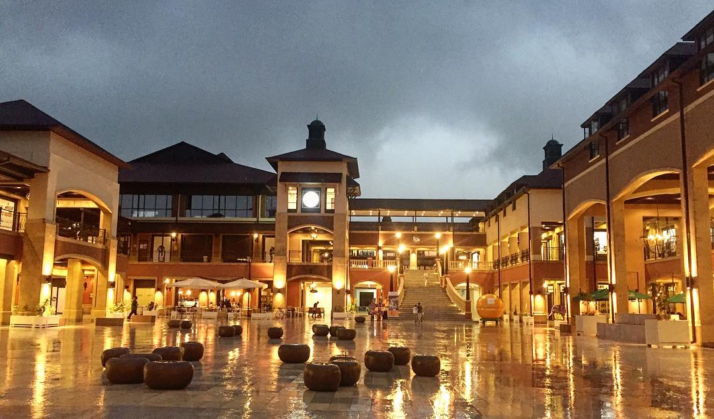

Nairobi is a city that seamlessly blends the modern with the traditional, and nowhere is this more evident than in its vibrant shopping malls. From the luxurious boutiques of Two Rivers and Village Market to the family-friendly attractions of The Hub Karen and Sarit Centre, Nairobi's malls offer unique experiences for every kind of visitor. Whether you're looking to shop high-end brands, explore artisanal crafts, or enjoy thrilling activities like Ferris wheels and bowling, these malls have it all. Add in diverse dining options, art displays, and family-oriented activities, and Nairobi’s malls become more than just shopping destinations—they’re cultural hotspots and community hubs. This guide covers all you need to know about the best malls in Nairobi, including directions, must-visit stores, dining recommendations, transportation tips, and what to expect. Get ready to discover a new side of Nairobi that’s as exciting as it is eclectic!

<h2 id="two-rivers-mall">1. Two Rivers Mall.</h2>

Two Rivers Mall on Limuru Road is East Africa's largest shopping complex, featuring a wide variety of international and local brands. It’s not only a shopping hub but also offers several exciting activities, including the tallest Ferris wheel in Africa, cinema experiences, and an expansive food court with everything from local Kenyan cuisine to popular international franchises.

> <b>Shopping Options:</b> With stores like LC Waikiki, Carrefour, and Swarovski, the mall caters to all budgets and tastes, from casual to luxury.

> <b>Dining: </b>The food court includes options like Artcaffé, Burger King, and local Kenyan eateries.

> <b>Entertainment:</b> In addition to shopping, visitors can enjoy a thrilling Ferris wheel ride for KES 500, check out VR experiences, or catch a movie at the cinema.

> <b>How to Get There:</b> You can take a matatu along Limuru Road or drive, which takes about 20 minutes from central Nairobi.

<h2 id="the-village-market">2. The Village Market.</h2>

The Village Market in Gigiri combines luxury shopping, cultural experiences, and family-friendly entertainment. Known for its Maasai market days, it offers handmade crafts and artifacts alongside high-end shops and global dining options. The open-air design and lush greenery make it perfect for a relaxed outing.

<b>Shopping Options:</b> Includes luxury stores and a Maasai market on Fridays, where you can buy unique Kenyan souvenirs.

<b>Dining: </b>Offers various cuisines, from Italian at Osteria to Lebanese at Kazana.

<b>Fun Activities:</b> Bowling, an aqua park, and an arcade make it a family-friendly spot.
How to Get There: Matatus along Limuru Road can drop you off near Gigiri, making it an easy stop for tourists or locals working in the UN area.

<h2 id="the-junction-mall">3. The Junction Mall.</h2>

Located on Ngong Road, The Junction Mall is well-loved for its rooftop dining and unique shopping mix of local and international brands like Mr. Price and Woolworths. It’s a calm space ideal for weekend outings and provides ample seating, allowing for a leisurely shopping experience.

<b>Shopping Options: </b>Includes high-street brands like Mr. Price and local clothing boutiques.

<b>Dining: </b>The rooftop dining area offers a fantastic view and restaurants like Brew Bistro.

<b>Activities:</b> With children’s play areas and a spacious layout, it's a comfortable family destination.

<b>How to Get There:</b> Matatus on Ngong Road stop right by the mall. Ideal visiting hours are weekday afternoons to avoid weekend crowds.

<h2 id="yaya-centre">4. Yaya Centre.</h2>

Located along Argwings Kodhek Road, Yaya Centre offers a high-end shopping experience with local and international boutiques, alongside gourmet food spots. It’s a popular spot among Nairobi’s elite and provides a quiet shopping atmosphere ideal for high-end fashion and lifestyle products.

<b>Shopping Options:</b> Known for premium stores and Nairobi’s largest Chandarana Foodplus.

<b>Dining:</b> Features gourmet eateries like Artcaffé and specialty coffee shops.

<b>How to Get There: </b>Matatus running along Argwings Kodhek Road provide convenient access. Weekdays are generally quieter and more enjoyable for relaxed shopping.

<h2 id="the-hub-karen">5. The Hub Karen.</h2>

The Hub, located in the scenic Karen suburb, is renowned for its eco-friendly design, open-air layout, and emphasis on sustainability. It’s a popular choice for both locals and tourists and provides a mix of high-end shops, cafes, and family-oriented activities.

<b>Shopping Options:</b> Fashion, beauty, and lifestyle stores like LC Waikiki and Body Shop are popular here.

<b>Dining:</b> Offers diverse culinary options from fine dining to family-friendly eateries.

<b>Activities:</b> Horse riding, a children’s play park, and regular weekend events.

<b>How to Get There: </b>Accessible by matatus on the Karen route, or a 30-minute drive from the city center. Ideal visiting hours are during weekends when the mall is liveliest.

<h2 id="westgate-mall">6. Westgate Shopping Mall.</h2>

Westgate Mall, located in Westlands, is a premier shopping destination focused on luxury brands, upscale dining, and leisure activities. It’s an excellent spot for tourists and locals looking for a more sophisticated shopping experience.

<b>Shopping Options:</b> Known for premium and luxury brands, alongside local artisan stalls.

<b>Dining:</b> From Java House to Artcaffé, Westgate offers a good mix of casual and fine dining.

<b>Activities:<b> Includes a cinema and regular art displays.

<b>How to Get There:</b> Easily accessible via Waiyaki Way matatus. Weekends and early evenings are ideal times to visit.

<h2 id="sarit-centre">7. Sarit Centre.</h2>

Sarit Centre in Westlands is one of Nairobi's oldest malls, yet it remains one of the busiest and most popular. Its strategic location in the heart of Westlands makes it a hub for both locals and tourists. The mall offers an extensive range of stores, services, and entertainment options.

<b>Shopping Options: </b>Features local shops, chain stores, and an expansive Chandarana supermarket.

<b>Dining:</b> Offers a large food court with fast food and sit-down dining.

<b>Activities: </b>Regular exhibitions, movie screenings, and kids' play zones.

<b>How to Get There:</b> Served by matatus on the Westlands route, about 15 minutes from the city center.

<h2 id="galleria-mall">8. Galleria Mall.</h2>

Galleria Mall, located on Langata Road, is known for its laid-back atmosphere and wide range of dining and shopping options. Its proximity to Nairobi National Park makes it popular among tourists seeking a blend of nature and shopping.

<b>Shopping Options:</b> A good mix of local and international stores, and a large Carrefour supermarket.

<b>Dining:</b> Offers fast-food outlets like KFC and casual dining options.

<b>Activities:</b> Perfect for family outings, with activities like an ice-skating rink.

<b>How to Get There:</b> Easily reachable by matatus on Langata Road. Ideal for weekend visits after a day at the National Park.

<h2 id="nextgen-mall">9. Nextgen Mall.</h2>

Nextgen Mall on Mombasa Road stands out for its tech-forward ambiance and futuristic design. It’s especially popular among young, tech-savvy shoppers and offers a range of stores, including electronics and lifestyle brands.

<b>Shopping Options:</b> A mix of tech stores, fashion outlets, and a large Naivas supermarket.

<b>Dining:</b> Offers casual dining and international fast-food chains.

<b>Activities: </b>Regular tech events, gaming zones, and movie screenings.

<b>How to Get There:</b> Accessible by matatus on the Mombasa Road route, especially convenient for travelers from the airport.

<h3>Tips for Visiting Nairobi Malls.</h3>
<i>Timing:</i> Weekdays, especially Tuesday to Thursday, are less crowded across malls. Weekends, especially mid-afternoon, are the busiest.
<i>Getting Around:</i> Use matatus on main routes for an affordable option, and ride-sharing services like Uber or Bolt for convenience.
<i>What to Bring:</i> Sunscreen for outdoor malls, comfortable shoes for walking, and a fully charged phone for digital payments.

Each mall in Nairobi offers a unique blend of shopping, dining, and entertainment that reflects Kenya’s dynamic culture and lifestyle. Whether you're seeking luxury, family-friendly activities, or unique souvenirs, Nairobi’s malls provide a shopping experience for everyone.
