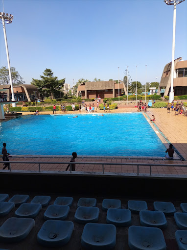
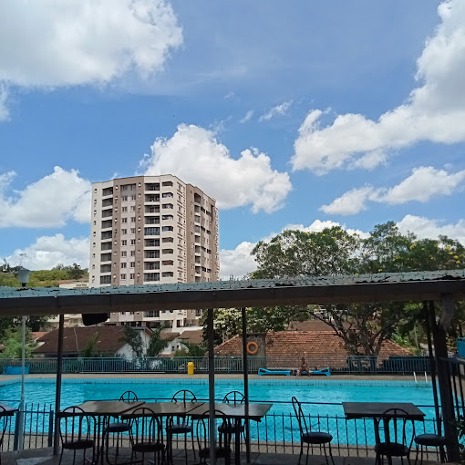
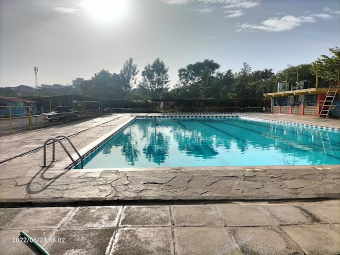
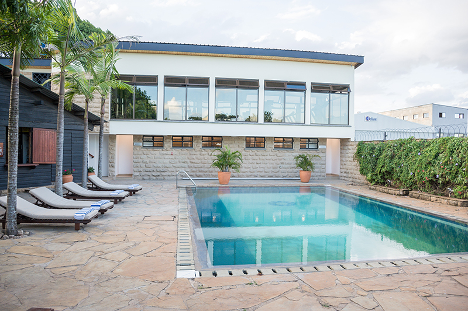
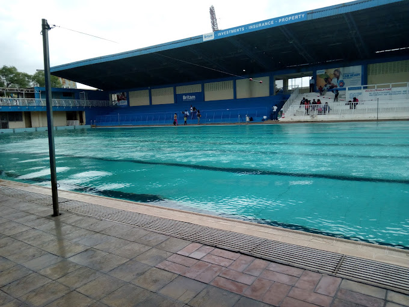

Nairobi is home to a variety of excellent swimming pools, catering to different budgets and offering a great way to unwind, beat the heat, and enjoy a refreshing weekend. Here’s a curated list of some of the best pools to check out, with information on prices, locations, and the easiest ways to get there.

<h2 id="kasarani-aquatic-stadium">1. Kasarani Aquatic Stadium.</h2>

Location: Moi International Sports Centre, Kasarani
Price: Kshs 150 on weekdays, Kshs 200 on weekends
Transportation: Easily accessible via matatus from Nairobi CBD, specifically Matatu Route 45
Details: This complex offers a variety of pools, including a competition pool, a diving pool with springboards, and training areas, making it ideal for swimming enthusiasts and families alike. It’s well-maintained, spacious, and usually open from 9 AM to 6 PM.

<h2 id="chester-house-swimming-pool">2. Chester House Swimming Pool.</h2>

Location: Chester House, Koinange Street, CBD
Price: Kshs 500 for adults, Kshs 300 for children
Transportation: Easily reachable by various matatus or a short walk from Kencom stage
Details: With a relaxed atmosphere, this pool is perfect for those looking to swim and lounge. Its convenient location makes it a favorite among locals and tourists alike, and it’s often open late into the evening.

<h2 id="ymca-swimming-pool">3. YMCA Swimming Pool.</h2>

Location: State House Road
Price: Kshs 200 on weekdays, Kshs 300 on weekends
Transportation: Accessible from the CBD via matatus on Route 34
Details: This pool is known for its cleanliness and affordability, with many families visiting on weekends. The pool is spacious and offers shallow sections for children, making it a safe and enjoyable spot for all ages.

<h2 id="barclays-sports-club-pool">4. Barclays Sports Club Pool.</h2>

Location: Off Thika Road near Utalii Hotel
Price: Kshs 300 for adults, Kshs 200 for children
Transportation: Can be accessed via matatus on Route 44 from the CBD
Details: This pool offers a well-maintained facility that includes changing rooms and a small lounging area. Open to the public, it provides an ideal setting for casual swimmers looking to unwind.

<h2 id="methodist-guest-house-pool">5. Methodist Guest House Pool</h2>

Location: Lavington, Oloitokitok Road
Price: Approximately Kshs 500
Transportation: Matatu Route 46 from the CBD
Details: This pool offers a more tranquil setting in a residential area. It’s perfect for swimmers looking to escape the hustle and bustle of Nairobi and enjoy a peaceful swim surrounded by greenery.

<h2 id="umoja-swimming-pool">6. Umoja Swimming Pool</h2>

Location: Umoja 1 Primary School, Embakasi West
Price: Kshs 200 for adults, Kshs 150 for children
Transportation: Reachable via Matatu Route 35 from the CBD
Details: This public pool is affordable and family-friendly. Although it can get crowded, it’s a fun spot for kids and budget-conscious visitors looking to cool off without leaving the city.

<h2 id="easa-pool">7. East African School of Aviation Pool.</h2>

Location: Near Jomo Kenyatta International Airport
Price: Kshs 200 for adults, Kshs 100 for children
Transportation: Matatus heading toward Embakasi serve this area
Details: This is a less crowded spot, providing a serene environment for swimming and relaxation. Its proximity to JKIA makes it a convenient stop for travelers and those in the nearby neighborhoods.

<h2 id="nyayo-national-stadium-pool">8. Nyayo National Stadium Pool</h2>

Location: Nyayo National Stadium, along Mombasa Road
Price: Kshs 150 for adults, Kshs 50 for children
Transportation: Accessible from the CBD via Route 34 or 33 matatus
Details: Known for its Olympic size, this pool is suitable for serious swimmers looking for ample space and a structured setting. It’s clean, affordable, and open to the public.

<h3 id="Tips-for-a-Great-Pool-Day-in-Nairobi">Tips for a Great Pool Day in Nairobi.</h3>
Visit Early: For a less crowded experience, try to visit in the morning, particularly on weekends.
Prepare Your Gear: Carry essentials like sunscreen, swimwear, towels, and drinking water.
Consider Weekdays: If possible, opt for a weekday visit to avoid weekend crowds, especially during the warmer months.
Check for Additional Amenities: Some pools offer food kiosks or cafes nearby, while others may provide loungers and shaded areas for relaxation.
These options showcase some of the best pools in Nairobi, catering to different tastes and budgets. With easy access by public transport, they’re perfect for a relaxing or active day out. So pack your swim bag, grab some friends or family, and dive into a refreshing experience at one of these top Nairobi pools.
