---

<h2 id="introduction">Introduction</h2>
Africa offers a range of incredible experiences from diverse wildlife and ancient monuments to thrilling adventures. Here are some of the most remarkable bucket list experiences and must-visit places on the continent.

<h2 id="safari-adventures">Safari Adventures: Encounter Africa’s Wildlife</h2>
- <h3 id="maasai-mara">1. Maasai Mara (Kenya)</h3>
  Witness the annual wildebeest migration and spot lions, elephants, and cheetahs.

  
  
- <h3 id="kruger-national-park">2. Kruger National Park (South Africa)</h3>
  Explore one of Africa’s largest parks and see the “Big Five.”

   
   
- <h3 id="serengeti-national-park">3. Serengeti National Park (Tanzania)</h3>
  Visit year-round for incredible landscapes and wildlife.

  

<h2 id="african-mountains">Climb Iconic African Mountains</h2>
- <h3 id="mount-kilimanjaro">4. Mount Kilimanjaro (Tanzania)</h3>
  Summit Africa’s highest peak for stunning views.
  
   
   
- <h3 id="mount-kenya">5. Mount Kenya (Kenya)</h3>
  Africa’s second-highest mountain with glaciers and unique flora.

   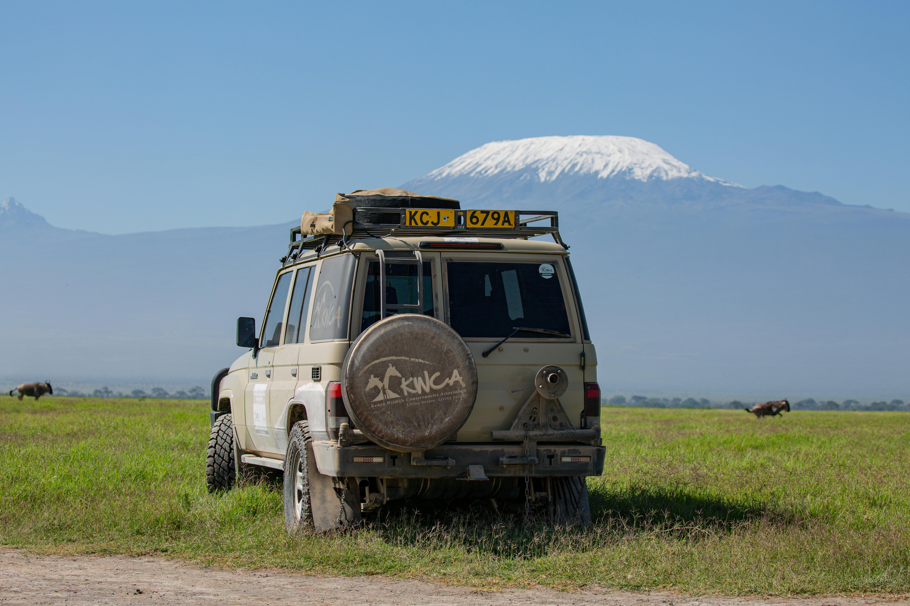
   
- <h3 id="drakensberg-mountains">6. Drakensberg Mountains (South Africa and Lesotho)</h3>
  Known for scenic hikes, rock art, and waterfalls.

  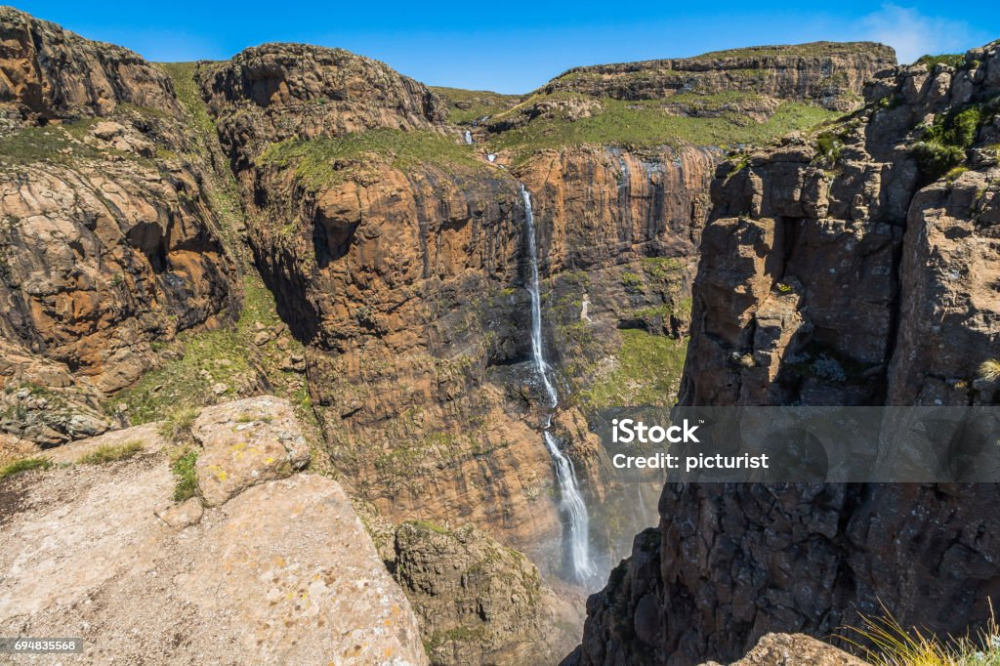

<h2 id="desert-expeditions">Desert Expeditions and Sand Dune Adventures</h2>
- <h3 id="namib-desert">7. Namib Desert (Namibia)</h3>
  Explore Sossusvlei’s red dunes, especially striking at sunrise and sunset.

  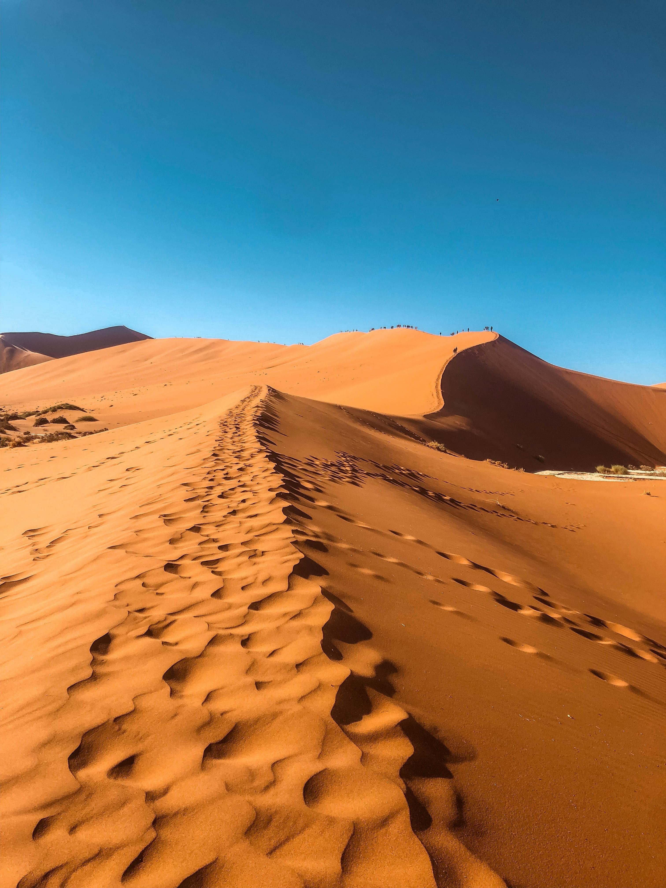
  
- <h3 id="sahara-desert">8. Sahara Desert (Morocco)</h3>
  Camel trek, sandboard, and camp under the stars in the vast Sahara.

  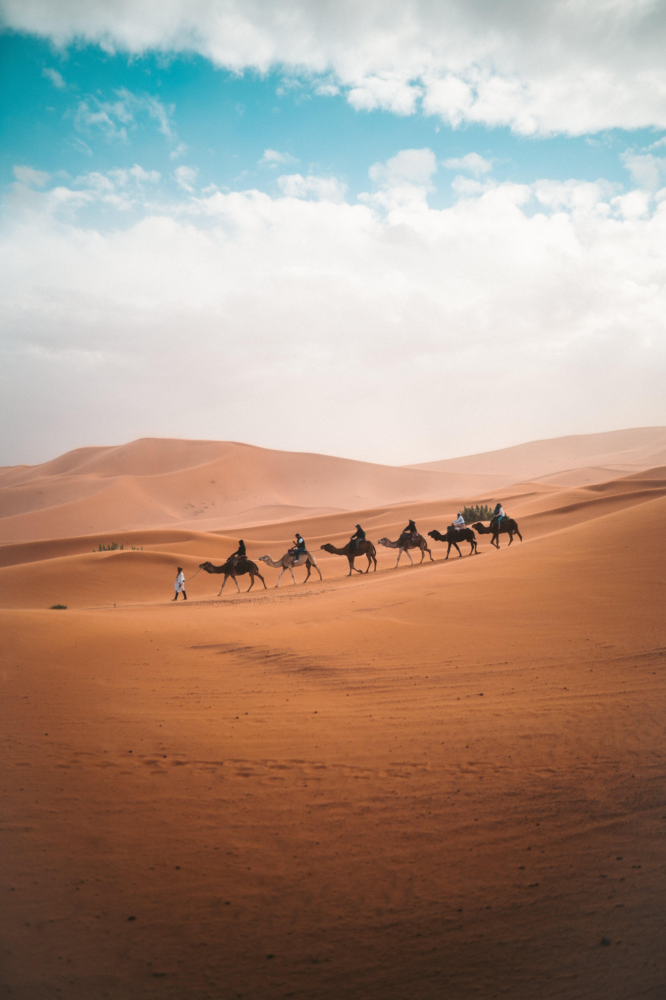
  
- <h3 id="danakil-depression">9. Danakil Depression (Ethiopia)</h3>
  Visit one of the hottest places on Earth, featuring salt flats and lava lakes.

  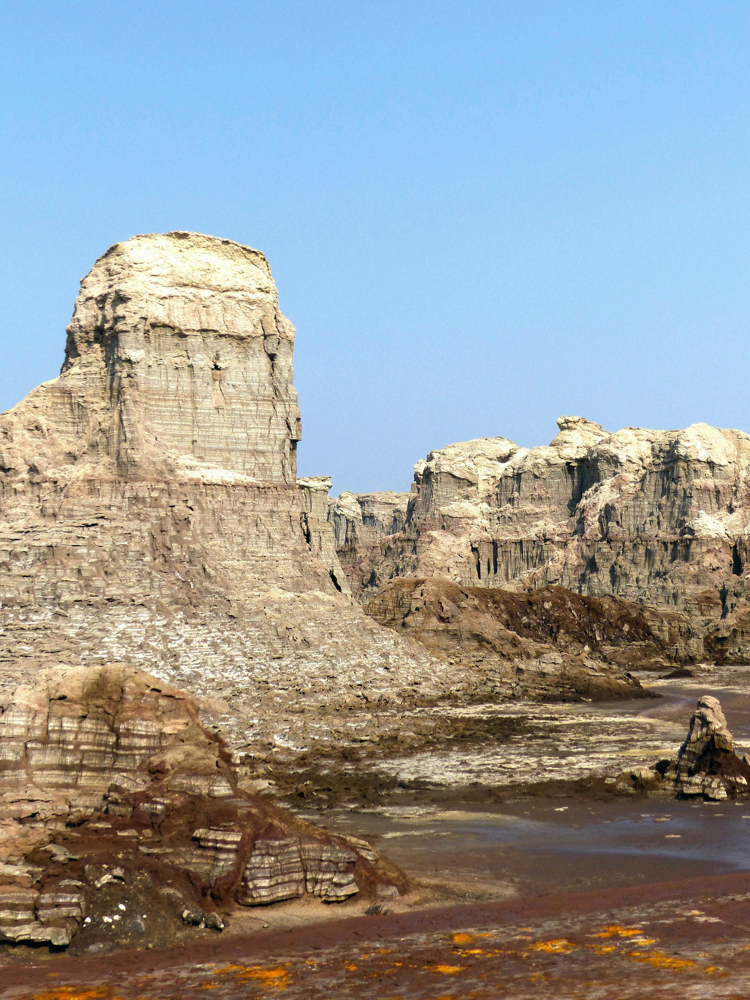

<h2 id="wildlife-encounters">Unique Wildlife Encounters</h2>
- <h3 id="gorilla-trekking">10. Gorilla Trekking (Uganda and Rwanda)</h3>
  Get up close to gorillas in their natural habitat.

  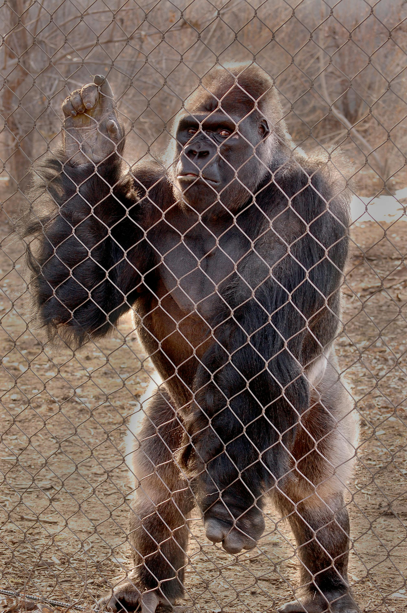
  
- <h3 id="madagascar-lemurs">11. Madagascar’s Lemurs</h3>
  Discover unique biodiversity and over 100 lemur species.

  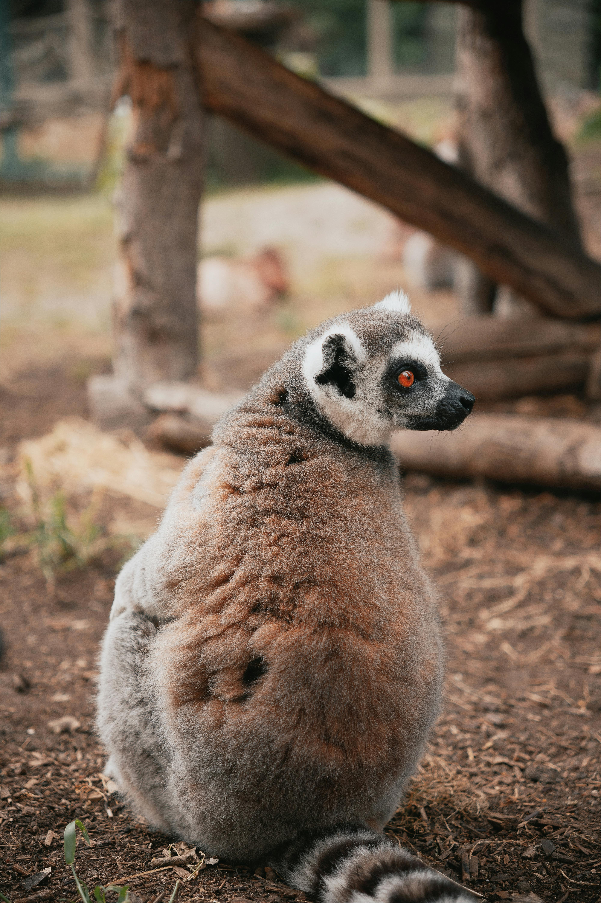
  
- <h3 id="penguins-boulders-beach">12. Penguins at Boulders Beach (South Africa)</h3>
  See African penguins waddling along the beach near Cape Town.

  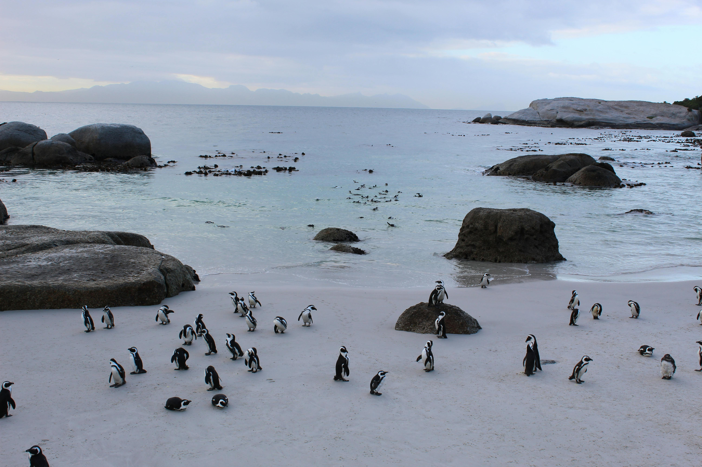

<h2 id="natural-wonders">Natural Wonders of Africa</h2>
- <h3 id="victoria-falls">13. Victoria Falls (Zimbabwe/Zambia)</h3>
  One of the Seven Natural Wonders of the World, with breathtaking views and adrenaline activities.

  
  
- <h3 id="okavango-delta">14. Okavango Delta (Botswana)</h3>
  A UNESCO site with mokoro (canoe) safaris among hippos and crocodiles.

  
  
- <h3 id="lake-malawi">15. Lake Malawi (Malawi)</h3>
  Enjoy crystal-clear waters and diverse fish species.

  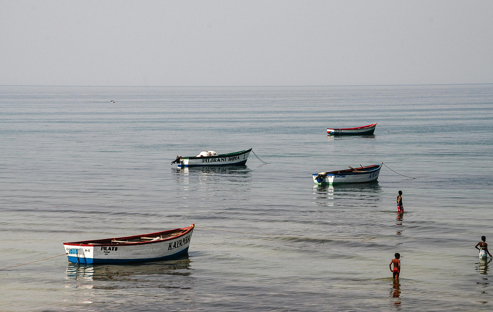
  

<h2 id="cultural-landmarks">Historical and Cultural Landmarks</h2>
- <h3 id="pyramids-giza">16. Pyramids of Giza (Egypt)</h3>
  The last standing ancient Wonder, near Cairo.

  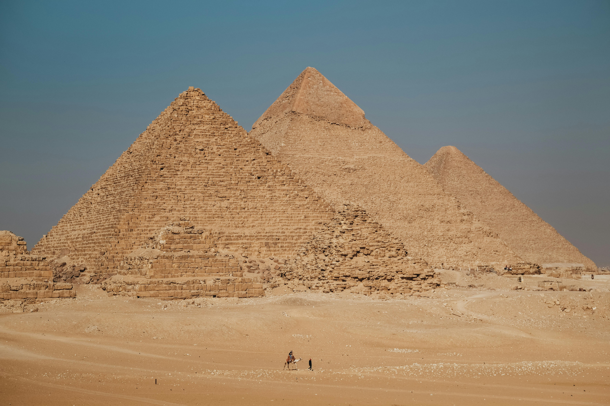
  
- <h3 id="lalibela-churches">17. Lalibela Churches (Ethiopia)</h3>
  12th-century rock-hewn churches still active for worship.
  
   
   
- <h3 id="great-zimbabwe-ruins">18. Great Zimbabwe Ruins (Zimbabwe)</h3>
  Ancient stone ruins that tell the story of an early African kingdom.

<h2 id="coastal-paradises">Coastal Paradises in Africa</h2>
- <h3 id="zanzibar">19. Zanzibar (Tanzania)</h3>
  Known for white-sand beaches, spice plantations, and historic Stone Town.

  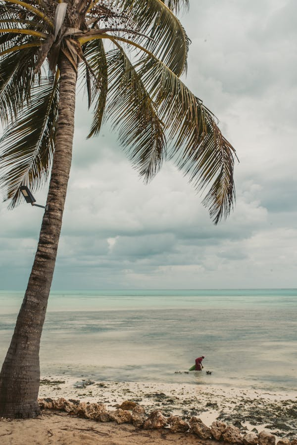
  
- <h3 id="seychelles">20. Seychelles</h3>
  A paradise of crystal-clear waters, coral reefs, and luxury resorts.

  
  
- <h3 id="cape-verde">21. Cape Verde</h3>
  A mix of beaches, Creole culture, and adventure activities.

  
  
<h2 id="adventure-sports">Adventure Sports and Unique Experiences</h2>
- <h3 id="balloon-ride-serengeti">22. Hot Air Balloon Ride over Serengeti (Tanzania)</h3>
  View the Serengeti’s vast landscapes from above.
- <h3 id="diving-red-sea">23. Diving in the Red Sea (Egypt)</h3>
  World-class diving sites with coral reefs and shipwrecks.
- <h3 id="rafting-zambezi">24. White-Water Rafting on the Zambezi River (Zambia)</h3>
  Thrill-seekers can enjoy rafting with intense rapids.

<h2 id="african-festivals">African Festivals and Cultural Experiences</h2>
- <h3 id="timkat-festival">25. Timkat Festival (Ethiopia)</h3>
  A celebration of Epiphany with colorful processions and music.
- <h3 id="festival-desert">26. Festival in the Desert (Mali)</h3>
  Celebrates Tuareg music and culture near Timbuktu.
- <h3 id="gnaoua-festival">27. Essaouira Gnaoua and World Music Festival (Morocco)</h3>
  Showcasing Morocco’s rich music in a vibrant setting.

<h2 id="conclusion">Conclusion</h2>
Africa is a continent rich in diverse cultures, breathtaking landscapes, and historical landmarks. Each experience offers a glimpse into its unique blend of natural beauty and cultural heritage, making Africa a must for every travel enthusiast’s bucket list. Embrace the chance to explore and appreciate its wonders for a journey that will leave you changed.
